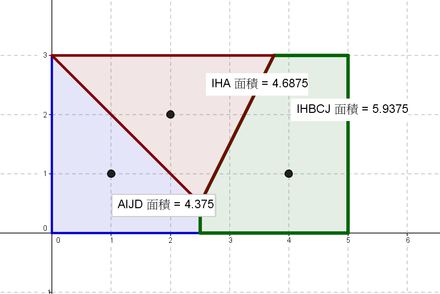

# 題目描述
> 「話說，剛剛明明說的是合乎聖誕節的商品。這不是 H-GAME 嗎？哪裡有聖誕元素啊！<br>
>「嗯，真虧你發現這點啊，但還是有點可惜，這是全齡版，沒有工口哦！」<br>
>「不管怎麼樣，一點也沒合聖誕節啊。」<br>
>「雖然你有好好學習許多東西，但對本質上完全沒有理解。」<br>
>「最近開始覺得有點明白了 …」<br>
>「那麼就來說明下這個作品吧」<br>
>「是一年前發售的大人氣美少女遊戲的續篇吧？」<br>
>「是的，那為什麼你沒有察覺到－『一年前』這句話所包含的意義」<br>
>「對於期盼著的人那就意味著 … 與戀人時隔一年的再會！」<br>

在 GALGAME 故事發展過程中，青梅竹馬幾乎沒勝過天降女友，但走哪一條線進行發展都是玩 GALGAME 的樂趣。<br>
然而有一款極為糟糕的 GALGAME 的初始方式則是在一開始選定座標下，系統會根據座標找到附近最鄰近少女，並且在隨後的故<br>事情節都會圍繞這名少女。遊戲的地圖設計很簡單，用一個矩形表示，現在已知 N 名少女的所在地 (都在矩形內部)。一開始選定<br>的座標也必須落在矩形內，請問玩哪每個線路機率分布為何？
# 輸入格式
輸入有多組測資。<br>
每組第一行會有三個整數 $N,A,B$，表示在 $[0:A]×[0:B]$ 地圖中有 $N$ 個已知座標。接下來會有 $N$ 行，第 $i$ 行上會有兩個整數<br> $x,y$，表示第 i 位少女所在的座標 ($x,y$) 保證不會有重疊的情況。
- $0<N≤8,0<A,B≤1000$
- $0≤x≤A,0≤y≤B$
# 輸出格式
對於每組測資輸出一行，根據輸入順序輸出每一個故事線的百分比機率 (四捨五入到整數)。
# 範例輸入
```
2 5 3
1 2
4 2
 
2 5 3
1 1
2 2
 
3 5 3
1 1
2 2
4 1
```
# 範例輸出
```
Case #1:
50
50
Case #2:
30
70
Case #3:
29
31
40
```
# 範例解釋

機率計算方式： $\frac{可以觸發的面積}{總面積}$
# 提示
- 蒙地卡羅模擬法  即可通過，增加取樣點到一定程度就可以通過。
- 使用半平面交算法，數學處理需要找中垂線方程式 ... 等。
## 如何產生浮點數亂數
```
#include <stdlib.h>
// generate uniformly distributed random numbers in [0 ... 1]
double frandom() {
    return rand() * 1.f / RAND_MAX;
}
```
> 別人計程有的內容我們也一定要有，接著創造出別人沒有的。 by 大中國抄襲主義
# Testdata Set
