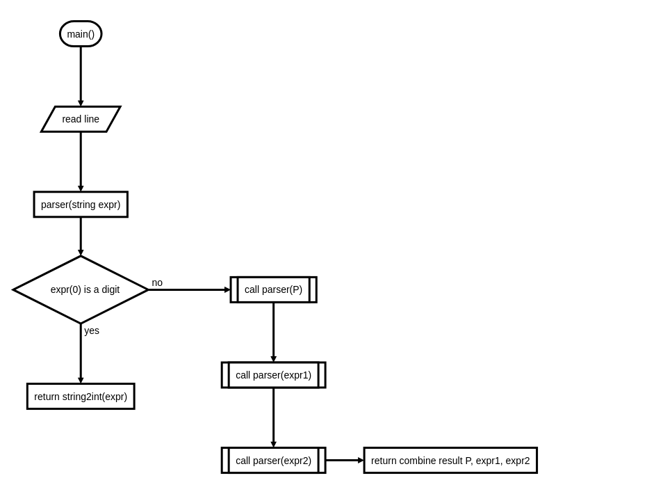

# 題目描述
期望值表達式有兩種規則，如下所示：<br>
- ⟨expr⟩&rarr;integer 
直接表示成一個整數，或者
- ⟨expr⟩&rarr;($p$ ⟨expr1⟩ ⟨expr2⟩)
回傳 $E$(⟨expr⟩)= $p$ &times;(⟨expr1⟩+⟨expr2⟩)+(1− $p$)&times;(⟨expr1⟩−⟨expr2⟩)

# 輸入格式
有多組測資，每組測資一行。
# 輸出格式
對於每組測資計算期望值，四捨五入至小數點第二位。
# 範例輸入
```
7
(.5 3 9)
(0.3 2 (1 1 -10))
(1.0 (1.0 (1.0 -1 -2) (1.0 -1 -2)) (1.0 (1.0 1 2) 2))
```
# 範例輸出
```
7.00
3.00
5.60
-1.00
```
# Testdata set
