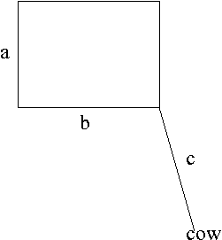

# Task Description
Write a program to determine how much grass a cow can eat. A cow is attached to a rope of length $c$, and the other end of the rope<br> is attached to a corner of a rectangular house of width a and depth $b$. Please determine the area the cow can browse.<br>
<br>
# Input
The input has three double precision number $a, b$, and $c$.
# Output
The output has a double precision number (in `%f`) format.
# Bounds
- We assume that $π$ = 3.1415926.
- $0<a,b≤1000$
- $c≤a+b$
# Sample input
```
10.0 10.0 5.0
```
# Sample output
```
58.904861
```
# # Testdata Set
