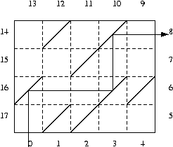

# Task Description
This exercise 6.10 in the textbook.<br>
We have a room with a lot of mirrors. The rectangular room is of size $W$ by $D$. You can think of the room consists of $WD$ square<br> cells, each is of unit length. Within each cell we may place a mirror. The mirror is two sided so that both sides reflect light. Now<br> there are $2(W+D)$ windows around the room, each is centered at one of boundary cells, Like in the following figure. If we stand<br> at window 0 and look into the room, we will see the person standing at window 8. Now write a program that, given the position of<br> these windows, calculates the windows number we would be able to see if we stand at a particular window.

# Input
The first line of the input has two numbers, $W$ and $D$, representing the width and the depth of the room. Both $D$ and $W$ are positive<br> integers and no more than 100. Each of the next $D$ lines has $W$ numbers, with 1 representing a mirror, and 0 for no mirror. The<br> numbers are from top to bottom, left to right.
# Output
The output has $2(W+D)$ lines, and each line has one number. The number in the $i$-th line indicates the window number that can be seen from the $i$-th window.
# Sample input
```
5 4
0 1 0 1 0
0 0 1 0 0
1 0 0 1 1
0 1 1 0 0
```
# Sample output
```
8
7
5
9
6
2
4
1
0
3
17
15
14
16
12
11
13
10
```
# Testdata Set

