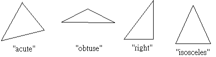

# Task Description
Given the three coordinates of three vertices of a triangle, determine whether it is an isosceles triangle, an acute triangle, an obtuse<br>triangle, or a right triangle. Here we assume that all coordinates are integers. Note that if an triangle is an isosceles triangle, you<br>triangle, or a right triangle. Here we assume that all coordinates are integers. Note that if an triangle is an isosceles triangle, you<br>three squares of the length of sides, rather than to compute the length. Suppose the square of the longest side is $a^{2}$, then you can<br>determine the shape of the triangle by comparing it with $b^{2}$ and $c^{2}$, which are the squares of the other two sides.<br>
平面上座標上，給定三角形的三個頂點座標，決定是否為等腰、銳角、鈍角或者是直角三角形。你可以假設所有座標皆<br>為整數。特別注意，如果一個三角形為等腰三角形，那麼就不必回報它是否為銳角或鈍角。<br>
為了防止計算誤差，若需要紀錄三角形的三邊長，最好使用其邊長的平方儲存，假設三邊長由長到短分別為 $a, b, c$，那<br>麼只需要比較 $a^{2}$, $b^{2}$, $c^{2}$ 之間的關係即可得到。<br>

# Input format
The first line contains one integer, $n$, indicate the number of input cases below. The following are $n$ lines, each contains six<br>integers, x<sub>1</sub>,y<sub>1</sub>,x<sub>2</sub>,y<sub>2</sub>,x<sub>3</sub>,y<sub>3</sub>, which are the three coordinates of three vertices of the triangle. Each integer is non-negative and less<br>than 1,000. All the input data will form a triangle correctly.
# Output format
For each case, print the type of the triangle, `isosceles`, `acute`, `obtuse`, or `right`.
# Sample input
```
4
0 0 1 1 1 0
0 0 1 3 3 0
0 0 1 1 3 0
0 0 1 2 1 0
```
# Sample output
```
isosceles
acute
obtuse
right
```
# Testdata Set
